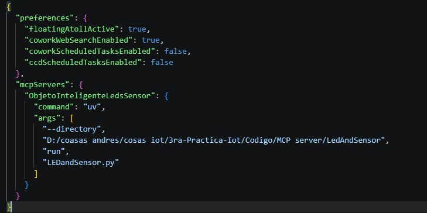
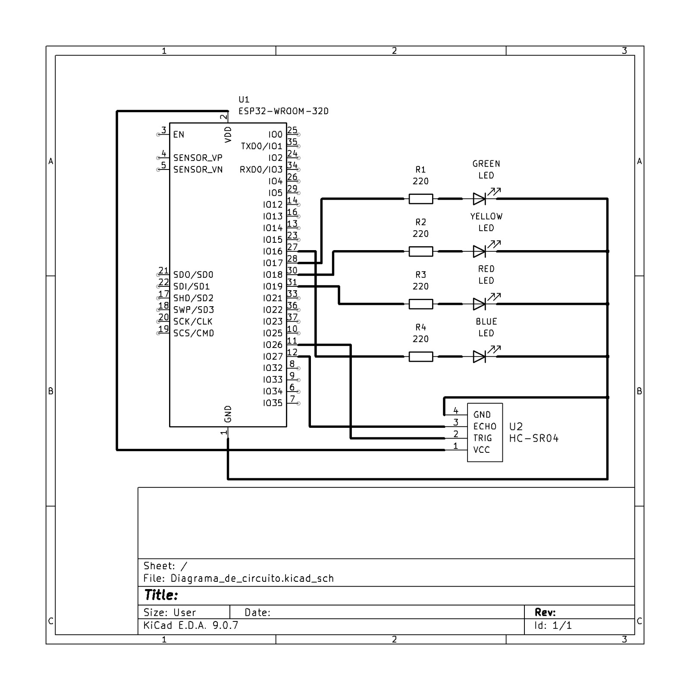
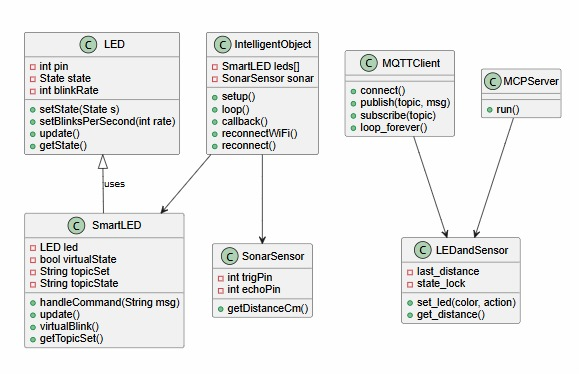
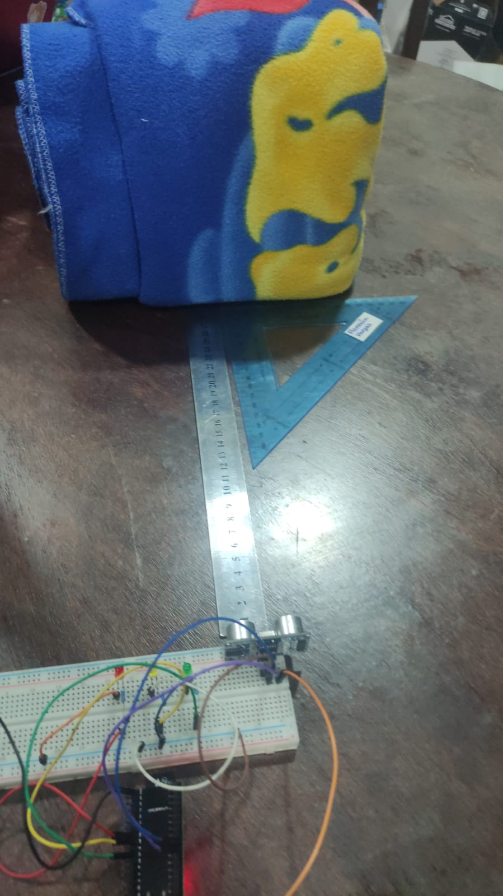
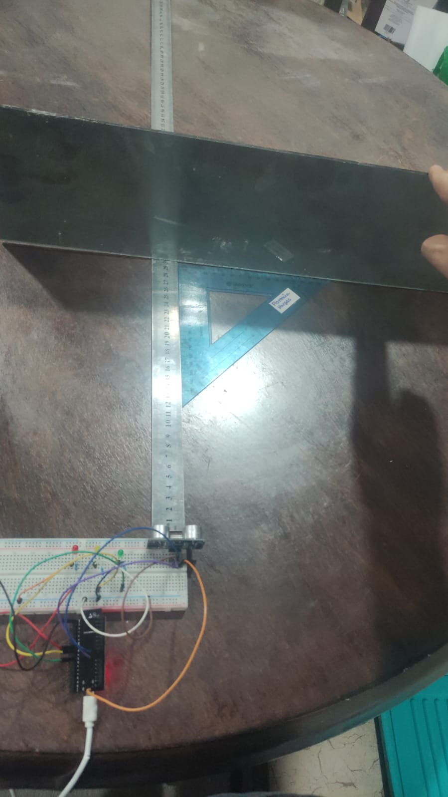
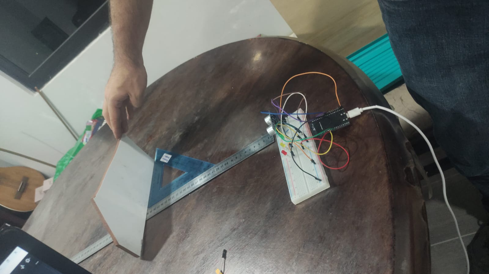
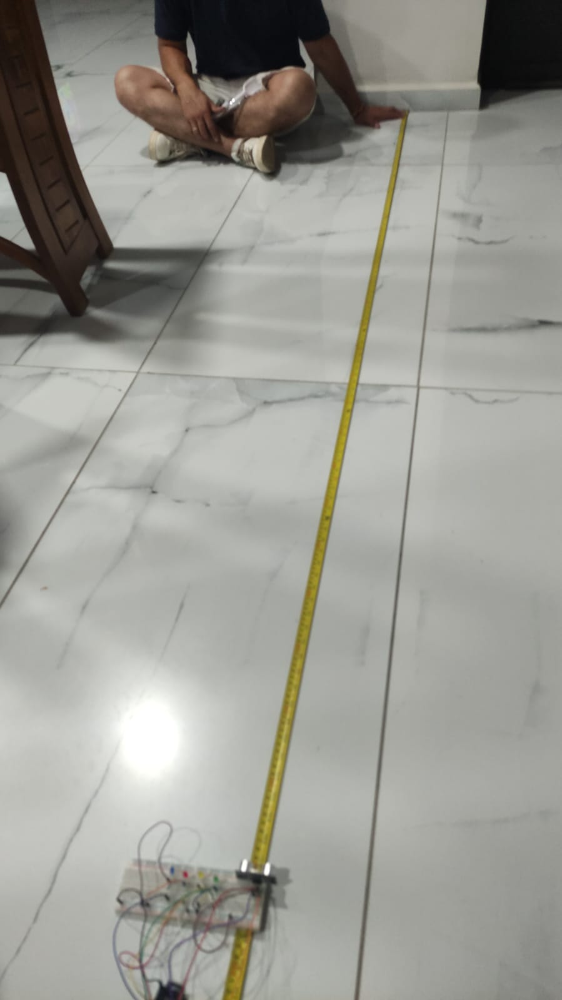
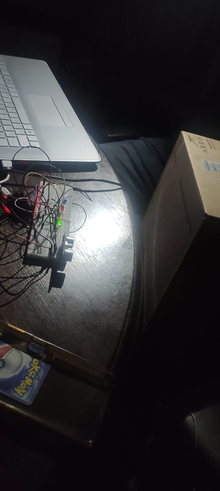
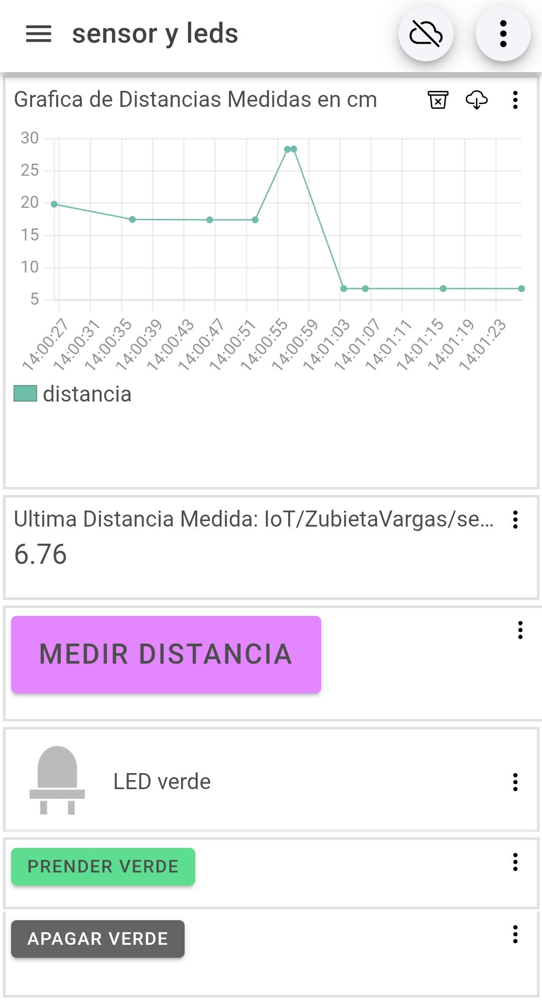
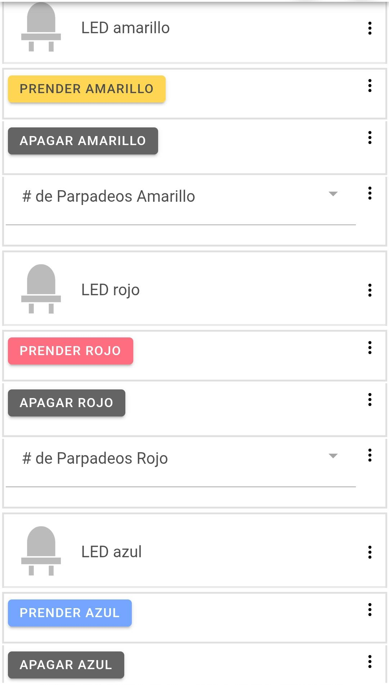

# Universidad Católica Boliviana Cochabamba
## Departamento de Ingeniería y Ciencias Exactas
## [SIS-234] Internet De Las Cosas
### Carrera de Ingeniería de Sistemas

---

# Informe sobre:
## Integración de un objeto inteligente con una aplicación móvil y una herramienta de IA con la ayuda de MQTT y MCP

### Práctica de la Materia Internet de las Cosas

**Autores:**

- Vargas Prado Ariana Nicole  
- Zubieta Sempertegui Andres Ignacio  

---

Cochabamba - Bolivia  
Abril 2026 

# 1. Implementación
## 1.1 Código fuente documentado

[Enlace a GitHub] https://github.com/NicoleVargasP/3ra-Practica-Iot
## 1.2. Configuraciones realizadas 

- Configuración de Claude para tener el servidor mcp activo.

# 2. Anexos 
## 2.1 Diseño del Sistema

## 2.1 Diagrama de circuito

## 2.2 Diagrama de arquitectura del sistema

## 2.3 Diagramas estructurales y de comportamiento
### 2.3.1 Diagrama de secuencia

### 2.3.2 Diagramas uml de clases

# 2.2

[Enlace a la planilla de pruebas](https://docs.google.com/spreadsheets/d/1DyKpLJWUTkjiDA7z87IJXlJ0ULdZPX75TzI_sI9DBeM/edit?gid=0#gid=0) 

### Imagenes de las pruebas

