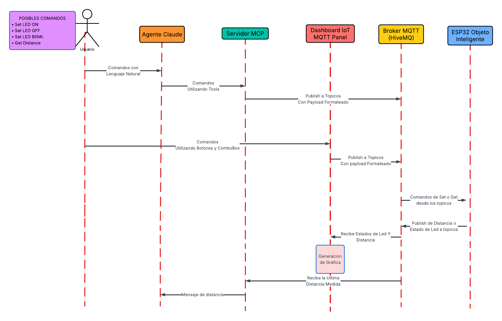

# Universidad Católica Boliviana Cochabamba
## Departamento de Ingeniería y Ciencias Exactas
## [SIS-234] Internet De Las Cosas
### Carrera de Ingeniería de Sistemas

---

# Informe sobre:
## Integración de un objeto inteligente con una aplicación móvil y una herramienta de IA con la ayuda de MQTT y MCP

### Práctica de la Materia Internet de las Cosas

**Autores:**

- Vargas Prado Ariana Nicole  
- Zubieta Sempertegui Andres Ignacio  

---

Cochabamba - Bolivia  
Abril 2026 
# 1. Introduccion
En la actualidad, el desarrollo de sistemas IoT (Internet de las Cosas) permite la integración de dispositivos inteligentes capaces de comunicarse entre sí a través de internet. En esta práctica se implementa un sistema basado en el protocolo MQTT, el cual facilita el intercambio eficiente de información entre un objeto inteligente, una aplicación móvil y una herramienta de inteligencia artificial.
El proyecto consiste en el diseño de un dispositivo equipado con sensores y actuadores que envía datos en tiempo real y recibe comandos remotos. Además, se incorpora una aplicación móvil para la visualización gráfica de la información y el control del sistema, junto con una herramienta de IA que permite interactuar mediante lenguaje natural. De esta manera, se demuestra la aplicación de tecnologías modernas en la automatización y el control inteligente de dispositivos.

# 2. Implementación
## 2.1 Código fuente documentado

[Enlace a GitHub] https://github.com/NicoleVargasP/3ra-Practica-Iot
## 2.2. Configuraciones realizadas 

- Configuración de Claude para tener el servidor mcp activo.
## 2.3 Lista de Topicos Utilizados
### 2.3.1 Topicos Leds
- IoT/ZubietaVargas/led/green/set
- IoT/ZubietaVargas/led/green/state

- IoT/ZubietaVargas/led/yellow/set
- IoT/ZubietaVargas/led/yellow/state

- IoT/ZubietaVargas/led/red/set
- IoT/ZubietaVargas/led/red/state

- IoT/ZubietaVargas/led/blue/set
- IoT/ZubietaVargas/led/blue/state
### 2.3.2 Topicos Sensor
- IoT/ZubietaVargas/sensor/get
- IoT/ZubietaVargas/sensor/distance

# 3. Diseño del Sistema

## 3.1 Diagrama de circuito

## 3.2 Diagrama de arquitectura del sistema

## 3.3 Diagramas estructurales y de comportamiento
### 3.3.1 Diagrama de secuencia

### 3.3.2 Diagramas uml de clases
Cabe destacar que la representación de Main y del servidor en el diagrama UML no implica que estos sean clases en la implementación real. Su inclusión responde únicamente a fines de modelado, con el objetivo de mejorar la comprensión de la estructura y el flujo de funcionamiento del sistema y el codigo de este.

# 4. Anexos
## 4.1 Pruebas 

[Enlace a la planilla de pruebas](https://docs.google.com/spreadsheets/d/1DyKpLJWUTkjiDA7z87IJXlJ0ULdZPX75TzI_sI9DBeM/edit?gid=0#gid=0) 

### Imagenes de las pruebas

## 4.2 Interfaz del IoT MQTT Panel

